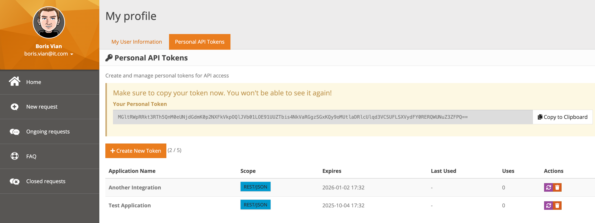

# iTop Portal Personal Tokens Extension

Enable Portal Users to create and manage personal API tokens for REST API access in iTop.

## Overview

This extension adds personal token management capabilities to the iTop Portal, allowing Portal Users to:
- Create personal API tokens for REST API access
- Manage token lifecycle (create, regenerate, delete)
- Set token expiration dates and scopes
- Use tokens for API authentication without sharing passwords

## Features

- **Portal Integration**: Seamlessly integrated into the iTop Portal user profile
- **Token Security**: Secure token generation and storage using iTop's existing authentication framework
- **Scope Management**: Control API access permissions per token (REST/JSON, Export, etc.)
- **Expiration Control**: Set token expiration dates (30, 90, 180, or 365 days)
- **Usage Tracking**: Monitor token usage count and last access times
- **CSRF Protection**: Built-in transaction ID validation prevents duplicate submissions
- **Multi-Language Support**: Full support for all 17 iTop languages (translations needed)
- **Upgrade Safe**: Survives iTop upgrades as a standard extension

## Requirements

- iTop 3.1.0 or higher
- `authent-token` module enabled
- Portal module installed and configured
- PHP 7.4 or higher

## Installation

1. Download the latest release
2. Extract to your iTop `extensions/` directory as `itop-portal-personal-tokens`
3. Run the iTop setup wizard
4. Select "Portal Personal Tokens" extension
5. Complete the installation
6. **Important**: Enable REST token authentication (see Configuration below)

For detailed installation instructions, see [DEPLOYMENT.md](docs/DEPLOYMENT.md)

## Configuration

**Required**: Enable REST API token authentication by adding to your `config-itop.php`:

```php
'allow_rest_services_via_tokens' => true,
```

**Without this setting, the Personal API Tokens tab will not appear in the user profile.**

You can also configure in iTop Admin Console:
1. Go to **Admin Tools** > **Configuration**
2. Find **allow_rest_services_via_tokens**
3. Set to **Yes** or **true**
4. Click **APPLY**

Optional settings:

```php
'portal_personal_tokens' => array(
    'max_tokens_per_user' => 5,  // Maximum tokens per user (default: 5)
),
```

## Screenshots

### Token Management Interface

*Main interface showing personal tokens with usage statistics and management actions*

### Token Creation

*Create new tokens with custom application name, scope, and expiration settings*

## Usage

### For Portal Users

1. Log into the iTop Portal
2. Navigate to "My Profile" → "Personal API Tokens" tab
3. Click "Create New Token"
4. Provide an application name and select:
   - Scope (REST/JSON or REST/JSON + Export)
   - Expiration (30, 90, 180, or 365 days)
5. Copy the generated token (it won't be shown again!)
6. Use the token in API calls

### API Authentication

Use the token in REST API calls:

```bash
curl -X POST https://your-itop.com/webservices/rest.php?version=1.3 \
  -d "auth_token=YOUR_TOKEN_HERE" \
  -d 'json_data={"operation":"core/get","class":"UserRequest","key":"SELECT UserRequest WHERE caller_id = :current_contact_id"}'
```

### Token Management

- **Regenerate**: Click the regenerate button to create a new token value (old token becomes invalid)
- **Delete**: Click the delete button to permanently remove a token
- **View Details**: See application name, scope, expiration date, usage count, and last use date

## Security Considerations

- Tokens are stored hashed in the database (never stored in plain text)
- Each token has a unique scope limiting its permissions
- Tokens expire automatically based on configured expiration date
- Users can only manage their own tokens (enforced at database query level)
- All token operations are logged via IssueLog
- CSRF protection prevents duplicate token creation
- Server-side transaction ID validation prevents replay attacks

## Architecture

### Implementation Approach

The extension uses iTop's **User Profile Tab Extension** system rather than ManageBricks:

1. **Hook Implementation**: `PersonalTokensUserProfileExtension` implements `iUserProfileTabContentExtension`
2. **Custom UI**: Twig templates for HTML, JavaScript, and CSS
3. **Form Handling**: POST request processing with CSRF protection
4. **Security**: Direct OQL queries with user_id filtering

### Why Not ManageBricks?

Initial attempts used ManageBricks, but we switched to the User Profile Tab Extension approach because:
- Direct control over UI/UX for token display and "copy token" functionality
- Simpler implementation for view-only data with custom actions
- Better integration with the user profile page
- No complex OQL JOINs or scope filtering needed

### Project Structure

```
itop-portal-personal-tokens/
├── module.itop-portal-personal-tokens.php  # Module definition
├── datamodel.itop-portal-personal-tokens.xml  # Permission extensions
├── en.dict.itop-portal-personal-tokens.php    # English translations
├── de.dict.itop-portal-personal-tokens.php    # German translations
├── src/
│   └── Hook/
│       └── PersonalTokensUserProfileExtension.php  # Main logic
├── templates/
│   ├── personal_tokens_tab.html.twig       # UI template
│   ├── personal_tokens_tab.ready.js.twig   # JavaScript
│   └── personal_tokens_tab.css.twig        # Styling
└── docs/                                    # Documentation
```

### Key Components

1. **PersonalTokensUserProfileExtension**
   - Implements `iUserProfileTabContentExtension` interface
   - Handles form submissions (create/delete/regenerate)
   - Prevents double-submission via static flags
   - Uses iTop's `AuthentTokenService` for token generation

2. **Templates**
   - Bootstrap 3 compatible UI
   - Modal dialog for token creation
   - Real-time form validation
   - Copy-to-clipboard functionality

3. **Security**
   - Transaction ID validation (handled by iTop's UserProfileBrickController)
   - User ID filtering in all OQL queries
   - AllowWrite/AllowDelete permission bypasses for portal users

## Development

### Testing

Test the extension in OrbStack/Docker:

```bash
# Deploy to test environment
orb -m itop-dev sudo cp -r . /var/www/itop/web/extensions/itop-portal-personal-tokens/
orb -m itop-dev sudo rm -rf /var/www/itop/web/data/cache-production
orb -m itop-dev sudo chown -R www-data:www-data /var/www/itop/web/data

# Access portal
open http://itop-dev.orb.local/portal/
# Login as portal user, navigate to Profile → Personal API Tokens
```

### Contributing

1. Fork the repository
2. Create your feature branch (`git checkout -b feature/amazing-feature`)
3. Commit your changes (`git commit -m 'Add amazing feature'`)
4. Push to the branch (`git push origin feature/amazing-feature`)
5. Create a Pull Request

### Translation Contributions

We welcome translations! The extension includes dictionary files for all 17 iTop languages:

**Supported Languages**: Czech, Danish, German, English, British English, Spanish, French, Hungarian, Italian, Japanese, Dutch, Polish, Brazilian Portuguese, Russian, Slovak, Turkish, Chinese

**Currently Available**:
- ✅ English (complete)
- ❌ All others (English fallback with translation markers)

See [TRANSLATION.md](TRANSLATION.md) for detailed translation instructions.

## Troubleshooting

### Tokens not appearing
- Ensure `allow_rest_services_via_tokens` is `true` in config
- Check that Portal User profile has PersonalToken write permissions
- Verify authent-token module is installed and enabled

### "Form already submitted" errors
- This is a safety feature - refresh the page to get a new transaction ID
- Check that cache has been cleared after deployment

### Token generation fails
- Ensure `AuthentTokenService` is available
- Check PHP error logs for exceptions
- Verify PersonalToken class exists

## Support

For issues, questions, or contributions, please use the GitHub issue tracker.

## License

This extension is released under the [AGPL-3.0 License](LICENSE).

## Credits

Developed for the iTop community to enable Portal Users to leverage REST API capabilities securely.

## Changelog

See [CHANGELOG.md](CHANGELOG.md) for version history and release notes.
